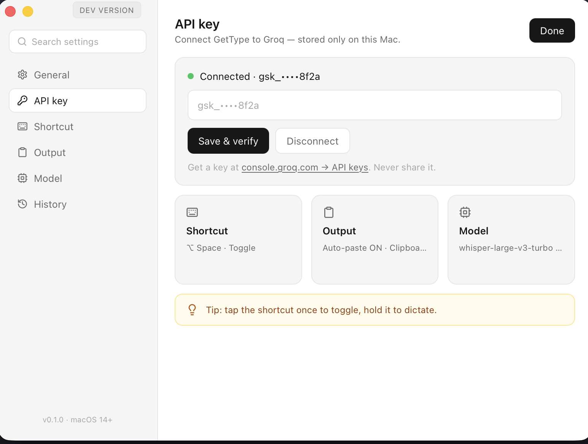

# getType

A lightweight dictation app for macOS. Press a global hotkey, speak — getType transcribes your voice to text and pastes it where your cursor is.

## How it works

1. Hold (or tap) the global hotkey → a small pill appears and records the microphone.
2. Release the key → the recording is sent to Groq speech-to-text.
3. The text is automatically pasted into the active app (⌘V simulation) and copied to the clipboard.

That's it — no Dock icon, just a menu bar icon.

## Features

- **Global hotkey** — push-to-talk (hold → speak → release) and toggle (tap → tap) modes.
- **Cancel with ESC** — cancels recording or transcription, nothing is saved or pasted.
- **Auto-paste + clipboard** — text is pasted at the cursor and copied; the previous clipboard content is restored afterwards.
- **Transcription history** — in Settings, with click-to-copy, delete, and clear-all.
- **Mini pill** — idle → recording → transcribing states, always on top, never steals focus.
- **Settings** — Groq API key (stored in Keychain, never in files), hotkey, mode, model and language, auto-paste/copy toggles, launch at login.
- **Permissions in one place** — microphone and Accessibility status (Accessibility is required for ⌘V paste).

## Screenshots



## Requirements

- macOS 13+
- Free Groq API key ([console.groq.com](https://console.groq.com)) — paste it in Settings, one-click verification included.
- Permissions: Microphone + Accessibility (System Settings → Privacy & Security).

## Development

```bash
npm install -g @tauri-apps/cli   # or: cargo install tauri-cli
cargo tauri dev                   # develop
cargo tauri build                 # build
```

Manual smoke test: hotkey → record → release → text appears in TextEdit/Safari.

## Project structure

- `src/` — frontend (vanilla HTML/CSS/JS): `pill.*` (the pill), `settings.*` (settings window)
- `src-tauri/src/` — Rust backend: `audio.rs` (capture), `hotkey.rs` (shortcuts), `stt.rs` (Groq), `output.rs` (clipboard + paste), `history.rs`, `permissions.rs`, `pill.rs`, `settings.rs`, `verify.rs`
- `plan-*.md` — feature plans (in Czech)

## Status

MVP done: record → transcribe → paste, history, ESC cancel, Dock icon while Settings is open.
